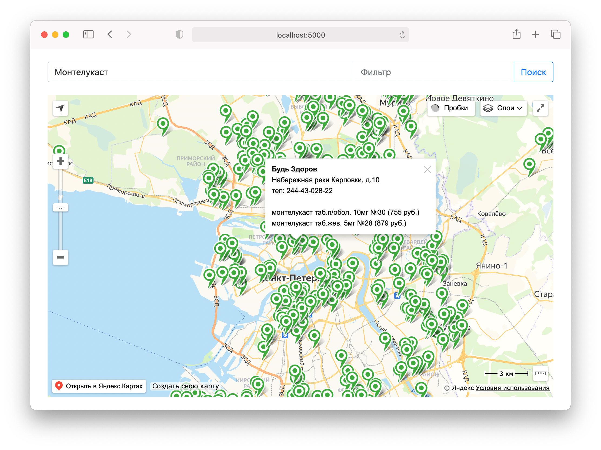

# acmespb-py

Это self-hosted веб-приложение для поиска по базе acmespb.ru. Результаты
выводятся на карту.

## Установка и запуск

Скачать и перейти в папку:

    $ git clone https://git.ch1p.io/acmespb-py.git
    $ cd acmespb-py

Создать и активировать venv:

    $ python3 -m venv venv
    $ . ./venv/bin/activate

Скачать зависимости:

    (venv) $ pip install -r requirements.txt

Запустить: 

    (venv) $ python ./app.py

## Возможные проблемы

- acmespb.ru может забанить за частые запросы. Чтобы этого избежать, между запросами
  делается задержка в 1 секунду (можно отключить в `static/app.js`). Если вас забанили,
  можно прописать и включить прокси. См. `acmespb.py`.
  
- Если вдруг у вас сломались Яндекс.Карты, получите свой ключ API и пропишите
  его в `templates/index.html` (см. параметр `apikey`).

## Лицензия

BSD-2c